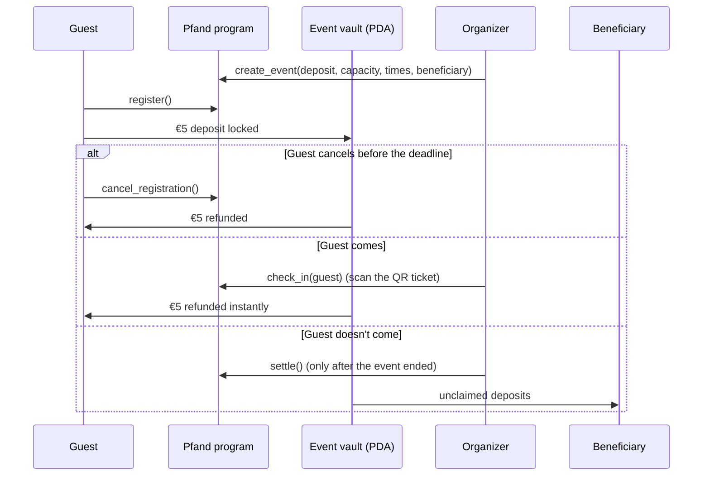

# Pfand

**Refundable no-show deposits for free events, on Solana.**

Guests lock a small stablecoin deposit (for example €5) when they sign up for a free event. When they are scanned at the door, the deposit goes straight back to their wallet. Deposits of people who never showed up go to a beneficiary the organizer named upfront: the club treasury or a charity.

Germany already solved this problem for bottles. Pfand does the same for event seats.

- **Live demo (devnet):** https://hepo306.github.io/Pfand/
- **Program (devnet):** [`FhmtxMbGXWjhgMVXdEEoreMsuexdRirXg76T9RXjMQeb`](https://explorer.solana.com/address/FhmtxMbGXWjhgMVXdEEoreMsuexdRirXg76T9RXjMQeb?cluster=devnet)

---

## The problem

Student clubs and communities run many free events: talks, workshops, founder meetups. Because signing up costs nothing, a large share of the people who register never come. Organizers plan rooms, catering and sponsor promises around numbers that don't hold, and people on the waitlist miss out on seats that stay empty.

A deposit fixes the incentive, but a normal payment setup does not fit a €5 deposit:

- card fees and payment-provider minimums eat a large part of a small amount,
- refunds take days and have to be triggered by hand, one by one,
- chargebacks and "who holds the money?" questions make a student club the custodian of other people's cash.

## Who it's for

1. **Organizers of free events** (student initiatives, meetups, community workshops) who want reliable attendance numbers.
2. **Guests** who want a fair rule: show up or cancel in time and you pay nothing.

The first users are the organizer's own communities in Frankfurt (Goethe AI, Founders Club Frankfurt), where the problem shows up at every event.

## How it works



1. **Create an event.** The organizer sets the title, times, deposit, capacity, free-cancellation deadline and the beneficiary for no-show deposits. The program creates an event account and a token vault owned by it.
2. **Register.** A guest signs one transaction. The deposit moves into the event vault and a ticket account records the registration. The app shows a QR ticket.
3. **Cancel (optional).** Before the deadline, the guest can cancel and gets the full deposit back. The spot is freed.
4. **Check in.** At the door the organizer scans the QR code with a phone. The program marks the ticket as attended and refunds the deposit in the same transaction.
5. **Settle.** After the end time, the organizer settles. What is left in the vault goes to the beneficiary. The event is closed for good.

## Why Solana

- **Refunds are the product.** Every guest who shows up triggers a refund. On Solana that costs a fraction of a cent and settles in about a second, so refunding at the door is practical. With cards, a €5 deposit would lose a big part to fees and the refund would arrive days later.
- **No custodian.** Deposits sit in a token account owned by a program-derived address. Nobody, including the organizer, can move them except by the program's rules: refund on check-in, refund on timely cancel, and release to the pre-committed beneficiary only after the event ended.
- **Stablecoins.** The program works with any SPL token. On mainnet the deposit would be in EURC or USDC, so guests think in euros, not in SOL.
- **Verifiable attendance.** Registrations and check-ins are public on-chain records. A club can show sponsors real, checkable attendance numbers instead of a sign-up count.

## What's in this repo

| Path | What it is |
| --- | --- |
| `programs/pfand` | The Anchor program (Rust) |
| `programs/pfand/tests` | End-to-end tests of the program on LiteSVM |
| `app` | The web app (React, Vite, Tailwind, Solana wallet adapter) |
| `app/scripts/init-faucet.mjs` | One-time setup of the devnet test-euro mint |

### Program instructions

| Instruction | Signer | What it does |
| --- | --- | --- |
| `create_event` | organizer | Creates the event account and its deposit vault |
| `register` | guest | Locks the deposit, creates the guest's ticket |
| `cancel_registration` | guest | Before the deadline: refunds the deposit, closes the ticket, frees the spot |
| `check_in` | organizer | Marks the ticket as attended and refunds the deposit |
| `settle` | organizer | After the end time: sends unclaimed deposits to the beneficiary |
| `init_faucet`, `faucet` | anyone | **Devnet only** (`devnet-faucet` feature): mints 20 test euros (pEUR) so the demo needs no real money |

### Rules enforced on-chain

- Only the organizer's key can check guests in or settle.
- A ticket can be refunded once: checking in twice, or cancelling after check-in, fails.
- Registration closes when the event starts, and capacity is enforced.
- Cancellation only works until the deadline the organizer set.
- Settling is only possible after the end time, so late arrivals can still check in.
- The beneficiary is fixed when the event is created and cannot be changed later.

These rules are covered by the tests in `programs/pfand/tests/test_pfand.rs`.

## Try the demo

The app runs on Solana **devnet**. Nothing costs real money.

1. Open the live demo and click **Connect**. On a phone, pick **Demo wallet** (it lives in your browser). On a laptop you can also use Phantom, Solflare or Backpack switched to devnet.
2. In the wallet menu, choose **Get 1 test SOL** (network fees) and **Get €20 test euros**.
3. As organizer: **Create an event**. The "Fill a 15-minute demo" button sets times that let you run the whole cycle in 15 minutes.
4. Open the event link on a second device, connect a different wallet and register. Your ticket QR appears.
5. On the organizer's device open **Scan**, point the camera at the ticket, and watch the guest's balance go back up.
6. After the end time, click **Settle** to send the no-show deposits to the beneficiary.

If the public devnet faucet is busy, paste your address on https://faucet.solana.com.

## Run it locally

Requirements: Rust, [Solana CLI](https://docs.anza.xyz/cli/install), [Anchor](https://www.anchor-lang.com/) 1.2, Node 20+.

```bash
# program: build and test
anchor build --tools-version v1.54 --arch v0
cargo test -p pfand

# local chain with the program loaded
solana-test-validator --reset --bpf-program FhmtxMbGXWjhgMVXdEEoreMsuexdRirXg76T9RXjMQeb target/deploy/pfand.so

# web app against the local chain
cd app
npm install
RPC_URL=http://127.0.0.1:8899 node scripts/init-faucet.mjs
VITE_RPC_URL=http://127.0.0.1:8899 npm run dev
```

### Deploy to devnet

```bash
solana config set --url devnet
solana program deploy target/deploy/pfand.so --program-id target/deploy/pfand-keypair.json
cd app && node scripts/init-faucet.mjs && npm run build
```

## Roadmap

- **Gasless for guests:** a fee payer sponsors transactions, so guests only need the deposit, not SOL.
- **Email login:** embedded wallets so guests sign up with an email address instead of a wallet app.
- **Door helpers:** let the organizer delegate check-in rights to volunteers' phones.
- **Waitlist:** when someone cancels, the next person on the waitlist gets the spot automatically.
- **Mainnet with EURC,** plus an attendance record per guest that clubs can use for sponsor reports.

## License

MIT
